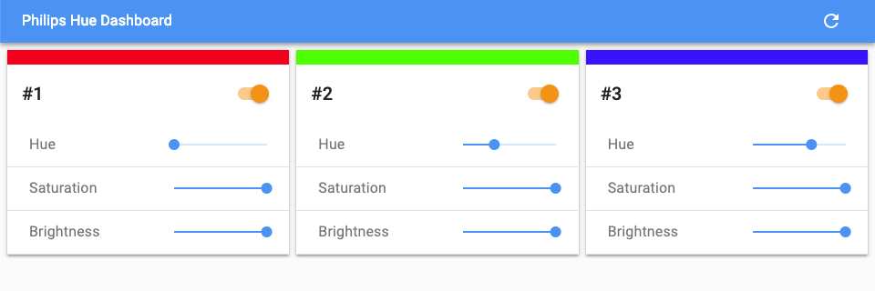

# hue-dashboard

Simple dashboard for Philips Hue.



## Usage

All authentication information is specified by URL search parameter.

```text
# This is an example
https://hue-dashboard.now.sh?server=https://192.168.1.3&username=Wh7zj8JORgxBcH83BamICvgnCHihUsiGLkAYW3fC
```

- **server:** IP address of the bridge
- **username:** Authorized user

If the bridge does not provide HTTPS, start hue-dashboard locally.

```sh
yarn install
yarn build
yarn serve
```

```text
http://127.0.0.1?server=http://192.168.1.3&username=Wh7zj8JORgxBcH83BamICvgnCHihUsiGLkAYW3fC
```
